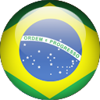

 

  <H1><b> Victor Sérgio Silva Barros </b> </H1>

 

  
  
  

Gerar respostas precisas e contextualizadas para perguntas técnicas.
Automatizar tarefas repetitivas de busca e análise de informações.

## Introdução

Este projeto tem como objetivo a detecção e reconhecimento de faces, utilizando o framework TensorFlow em conjuntos com outras bibliotecas.

## Estrutura do Projeto

1. **Criação da Base de Conhecimento**:
  - Colocar os arquivos de imagens conhecidas na pasta known com o nome no arquivo

  
  

2. **Imagens desconhecidas**:
  - Colocar os arquivos de imagens desconhecidas na pasta unknown

  

## Requisitos

- Python 3.7 ou superior.
- Framework TensorFlow ou PyTorch para desenvolvimento e treinamento de modelos de IA.

## Referência

Para mais detalhes, consulte: https://docs.n8n.io/

 ## Baixar
  [Baixar Notebook](face_recognition.ipynb)

## Licença

Este projeto está licenciado sob a Licença MIT.

## Controle de versão
 
1.0.0
 
 
## Autor
 
**Victor Sérgio Silva Barros**: 

  

  

  

  
  

Por favor, siga o github e junte-se a nós!
Obrigado pela visita e boa codificação!

